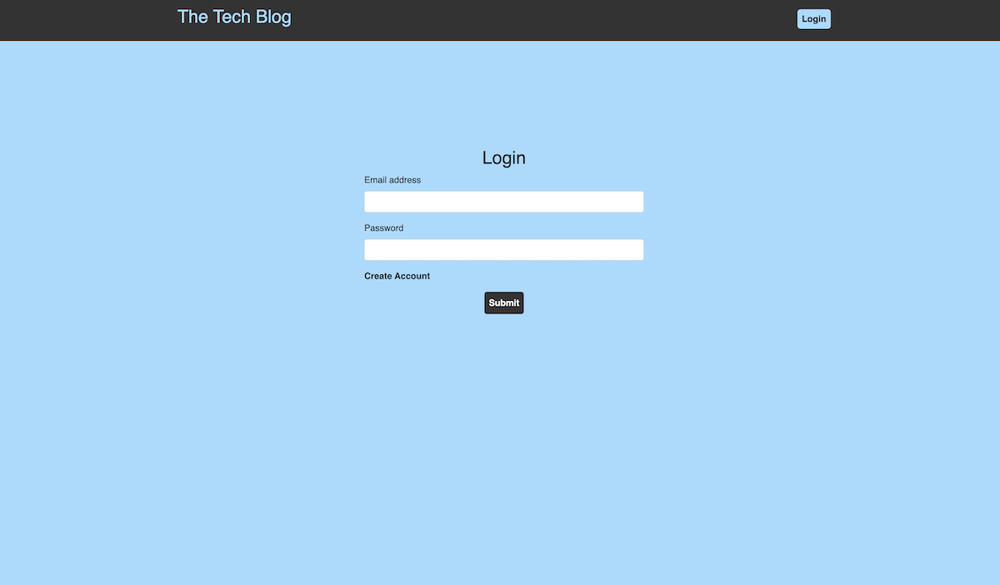

   <h1 align="center"> Tech Blog   </h1>

## Description

  You can see the project repository <b> [here](https://github.com/mihaelavalac/tech-blog). </b>  
  You can navigate to the deployed site <b> [here](https://tech-blog-mihaela.herokuapp.com/). </b> 

  
<i>The purpose of this application is to allow developers to create an account and share different blog posts with others developers. After creating an account, an user can create a blog post by adding the title and the content of the post. As well, an user can edit or delete his/her blog or upvote and comment others blogs.</i>
 
  
AS A developer who writes about tech  
I WANT a CMS-style blog site  
SO THAT I can publish articles, blog posts, and my thoughts and opinions.

## Table of Contents

- [Installation](#installation)
- [Features](#features)
- [Contributing](#contributing)
- [License](#license)
- [Questions](#questions)

## Installation

Follow the instructions to install this project on your local machine:   1. Download Nodejs to your computer.   2. Clone the project repo to your computer `git clone git@github.com:mihaelavalac/tech-blog.git`   3. Navigate to the root of the project through your text editor.   4. Open terminal and run the following command `npm i` to install the npm dependencies   5. Run the `npm start` to start the app   6. Navigate to the `http://localhost:3001/`.   7. You should see the home page like bellow.      8. Click the `login` button to be redirected to the login page where you can by redirected to create an account. (At least 4 characters required for password)           9. Log into your account to create/edit a new/existing post, leave comments, or vote.

 
 
 
 
 
 

## Features
GIVEN a CMS-style blog site  
WHEN I visit the site for the first time 
THEN I am presented with the homepage, which includes existing blog posts if any have been posted; navigation links for the homepage and the  dashboard; and the option to log in 
WHEN I click on the homepage option 
THEN I am taken to the homepage 
WHEN I click on any other links in the navigation 
THEN I am prompted to either sign up or sign in 
WHEN I choose to sign up 
THEN I am prompted to create a username and password 
WHEN I click on the sign-up button 
THEN my user credentials are saved and I am logged into the site 
WHEN I revisit the site at a later time and choose to sign in 
THEN I am prompted to enter my username and password 
WHEN I am signed in to the site 
THEN I see navigation links for the homepage, the dashboard, and the option to log out 
WHEN I click on the homepage option in the navigation 
THEN I am taken to the homepage and presented with existing blog posts that include the post title and the date created 
WHEN I click on an existing blog post 
THEN I am presented with the post title, contents, post creator’s username, and date created for that post and have the option to leave a comment 
WHEN I enter a comment and click on the submit button while signed in 
THEN the comment is saved and the post is updated to display the comment, the comment creator’s username, and the date created 
WHEN I click on the dashboard option in the navigation 
THEN I am taken to the dashboard and presented with any blog posts I have already created and the option to add a new blog post 
WHEN I click on the button to add a new blog post 
THEN I am prompted to enter both a title and contents for my blog post 
WHEN I click on the button to create a new blog post 
THEN the title and contents of my post are saved and I am taken back to an updated dashboard with my new blog post 
WHEN I click on one of my existing posts in the dashboard 
THEN I am able to delete or update my post and taken back to an updated dashboard 
WHEN I click on the logout option in the navigation 
THEN I am signed out of the site 
WHEN I am idle on the site for more than a set time 
THEN I am able to view comments but I am prompted to log in again before I can add, update, or delete comments

## Contributing

To contribute to the project just fork and install it on your computer, add the desired features/changes and push it back to the git. I will review the changes and merge them in the main branch.  

<b>Current Contributors:</b>  
👪 Mihaela Valac

## License

This application is covered by the <b>[GPL-2.0](https://opensource.org/licenses/GPL-2.0)</b> license.

## Questions

For questions please contact me on:  

:octocat: Github: [mihaelavalac](https://github.com/mihaelavalac)  
✉️ Email: mihaelavalac@yahoo.com 
